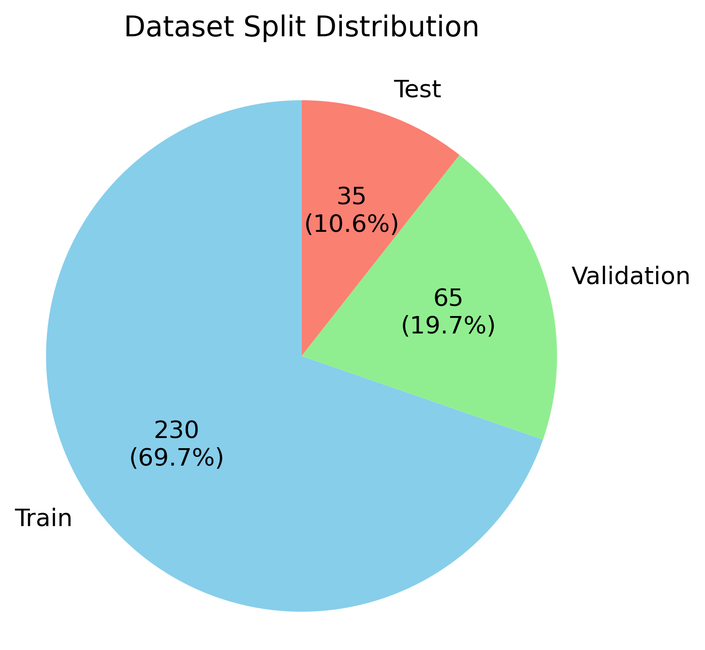
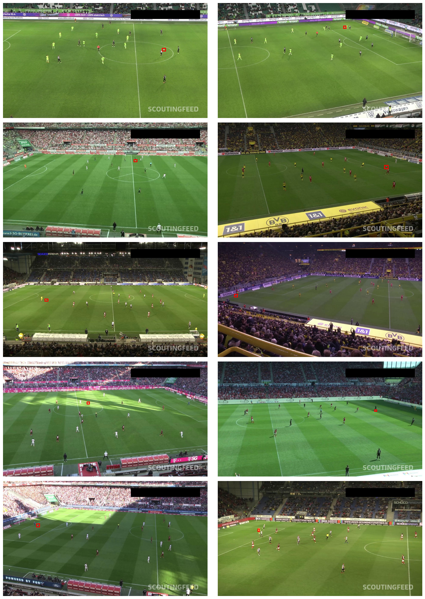
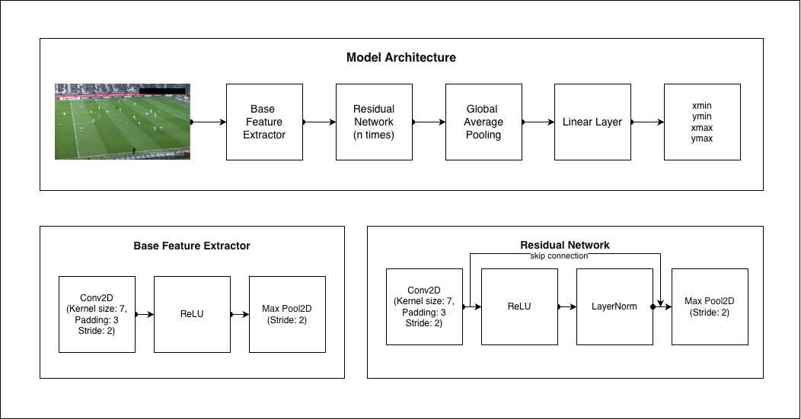
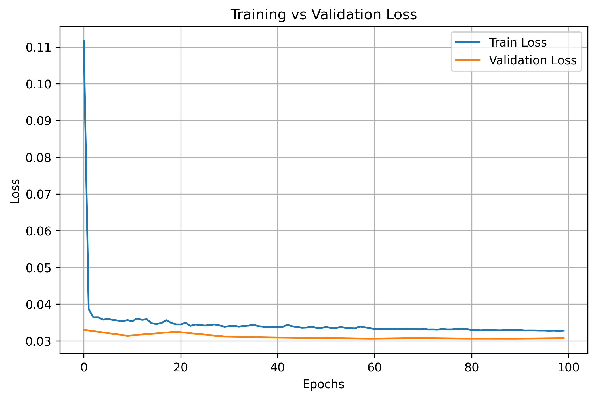
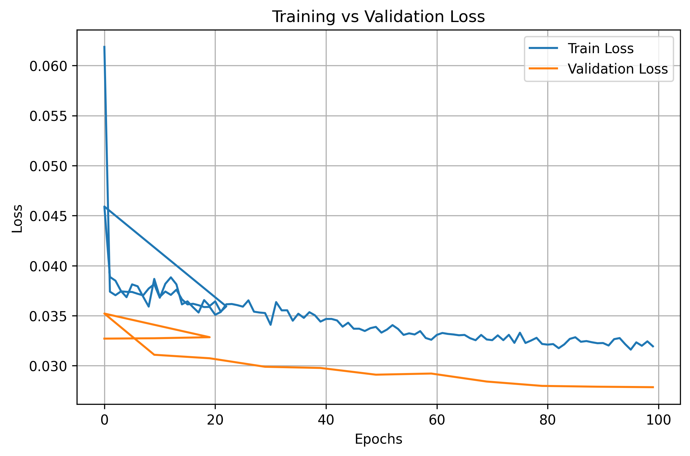
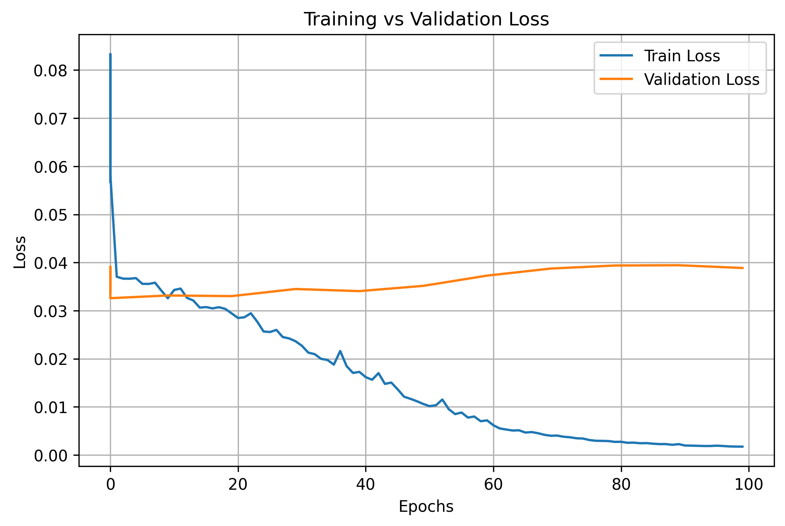

# **Object Detection Report: Football Localization in Soccer Field Images**

## **1. Project Overview**
### **1.1. Goal**
The objective of this project was to detect and localize the position of a football (soccer ball) within images of a soccer field.

### **1.2. Given**

A labeled dataset containing images annotated with bounding boxes following the PASCAL VOC format (xmin, ymin, xmax, ymax). The dataset was divided into training, validation, and testing splits.
    
### **1.3. Tasks Completed**

- Analyzed and explored the provided data to identify appropriate modeling strategies.
- Developed a Convolutional Neural Network (CNN) to detect the football in images.
- Optimized the model on the training dataset, validated during training, and evaluated performance on the test dataset.
- Reported the mean detection accuracy (or equivalent metric) on the training, validation, and test sets.

### **1.4. Structure of this Repository**

```
football-detection/
│
├── 📁 modules/                         # Core implementation modules
│   ├── 📄 data.py                      # Dataset classes, transforms, and data loaders
│   ├── 📄 model.py                     # Model architectures and configurations
│   ├── 📄 trainer.py                   # Training loop and checkpoint management
│   ├── 📄 evaluator.py                 # Validation/testing logic and metrics
│   ├── 📄 experiment.py                # Experiment config and version management
│   └── 📄 utils.py                     # Helper functions (viz, logging, utils)
│
├── 📁 outputs/                         # Experiment results and artifacts
│   ├── 📁 experiment_1/                # Individual experiment run
│   │   ├── 📁 checkpoints/             # Model weights and training states
│   │   ├── 📁 logs/                    # Training logs and TensorBoard files
│   │   └── 📄 experiment_config.json   # Snapshot of experiment settings
│   │
│   └── 📁 experiment_2/                # Additional experiment runs...
│       ├── 📁 checkpoints/
│       ├── 📁 logs/
│       └── 📄 experiment_config.json
│
├── 📄 datasetup.py                     # Data dowmload and extract script
├── 📄 train.py                         # Main training script entry point
├── 📄 data_analysis.ipynb              # EDA and dataset visualization
├── 📄 results_analysis.ipynb           # Model performance analysis
└── 📄 requirements.txt                 # Project dependicies
```


### **1.5. Running an Experiment with this Reposi**

- Create a virtual environment with conda, venv, poetry, or any package manager of choice.
- Activate the virtual environment.
- Run the `pip install -r requirements.txt` command to install required packages.
- Run python datasetup.py to download and extract the dataset.
- Edit training configuration parameters in train.py.
- Run python train.py to train the model.
- Use `results_analysis`.ipynb to load and analyze results.

---

## **2. Data Exploration**

### **2.1 Dataset Size and Distribution**

##### **Purpose:**

To determine how many images are in the dataset and how they are distributed across the training, validation, and test sets. This informed the choice of modeling strategy because:

- A **small dataset** typically requires a simpler model and extensive data augmentation to generalize.
- A **large dataset** enables training more complex architectures with reduced overfitting concerns.

Additionally, I verified that the train/val/test split adhered to standard data splitting conventions.

##### **Method:**

- Calculated the total number of images in the dataset.
- Determined the distribution of images across the training, validation, and test sets.

##### **Findings:**

- The dataset contains a total of 330 images.
- The training set contains 230 images (69.7%), the validation set contains 65 images (19.7%), and the test set contains 35 images (10.6%).
- The dataset is balanced across the three classes.

<p align="center">
  
       <br><br>
       <b>Figure 1: Data Distribution Across Training, Validation and Test Sets</b>
</p>

##### **Conclusion:**

The dataset was properly split across the three categories. However, the small size of the dataset may limit the model's ability to learn or generalize to new, unseen data. Therefore, it is recommended to train a small model and use data augmentation techniques to increase the size and diversity of the dataset, as this could improve the model's performance.

---
### **2.2 Dataset Quality Analysis**

##### **Purpose:**

To assess the accuracy of bounding box annotations and the diversity of the image dataset. A high-quality dataset requires both precise labels and sufficient variability to ensure robust model generalization under real-world conditions.

##### **Method:**

- Randomly sampled images from the dataset.
- Performed a visual inspection of the samples and confirmed the quality of their bounding boxes.
- Audited the dataset for a wide range of visual and environmental factors (e.g., lighting, background variation, weather, object occlusion, weather e.t.c.).


##### **Findings:**

As depicted in Figure 2 below,

- The annotations appears to be accurate and consistent, as there are a no loose boxes, and any boxes shifted away from the object.

- The dataset also exhibits a fair amount of diversity, as the images display variability in lighting, camera viewpoints, and the type of football used. The dataset, however, seems to lack variable environmental conditions, such as cloudy or rainy weather; hence, any model developed from it might not perform well under such conditions. The objects in the dataset also appear to be of a consistent scale.

- The target object (football) is very small and constitute only a small percentage of the entire image. This would likely make training difficult as we cannot reduce the size of the given image or zoom out the image without worrying that the entire ball could disappear.

- The training, validation, and testing data appear to have been selected randomly from a single pool. This approach helps to ensure that the model is trained and evaluated on the same data distribution.

<p align="center">
  
       <br><br>
    <b>Figure 2: Quality Analysis of Sample Data</b>
</p>

  
  

##### **Conclusion:**

Based on the findings, any additional augmentation performed must be robust and prioritize the visibility of the target object in transformed images. Geometric transformations such as scaling (only zooming in) and flipping are good choices, but it is essential we test a whole range of both geometric and photometric augmentations to determine which would contribute better and which wouldn't.


---


## **3. Data Augmentation**

##### **Purpose:**

To evaluate how various data augmentation strategies affect dataset quality, with a specific focus on the visibility of the football after transformation.

##### **Method:**
- Applied a range of geometric and photometric augmentation techniques to sample images from the training set.
- Assessed the impact of each technique on football visibility to determine the optimal augmentation strategy.
- Tuned the augmentation parameters to quantify the risk associated with each technique.  

##### **Strategies tested and Findings:**

The football, being a small object, is highly vulnerable to geometric transformations that reduce its size or shift it outside the image frame. Its typical position near the edges of the frame further increases this risk. However, its uniform color and circular shape make it resilient to photometric changes and rotational transforms, respectively.

The risk profile of each augmentation technique analyzed is summarized below:  

| Transform | Safe Range | Ball Visibility Risk Level | Rationale |
| :--- | :--- | :--- | :--- |
| **Horizontal Flip** | `p=0.0 to 1.0` | 🟢 Low | Preserves all image content; only mirrors it. No risk of the ball disappearing. |
| **Vertical Flip** | `p=0.0 to 1.0` | 🟢 Low | Preserves all image content; only flips it vertically. No risk of the ball disappearing. |
| **Rotation** | `limit <= 10°` | 🟢 Low | Minimal content loss at the edges. The ball's visibility is largely unaffected. |
| **Zoom In** | `scale=1.0 to 1.1` (0-10%) | 🟢 Low | Increases the relative size of the ball, making it more visible and easier to detect. |
| **Color/Brightness/Contrast** | `brightness limit <= 0.1, contrast limit <= 0.1` | 🟢 Low | Alters only pixel values; no geometric changes to object size or location. Change is generally uniform. |
| **Translation** | `translate_percent=0.0 to 0.05` (0-5% shift) | 🟡 Medium | Risk is positional. A small shift is safe unless the ball is on the very edge of the frame. |
| **Perspective Warp** | `scale ≤ 0.1` (Mild) | 🟡 Medium | Can warp the ball or shift it near the edge. Mild distortion is generally safe. |
| **Cropping** | `-` | 🔴 High | While risk is positional, the ball will be lost if it lies within the area being cropped out. This is a huge risk to allow. |
| **Zoom Out** | `-` | 🔴 High | The ball becomes minuscule, and could easily fall become undetectable. |


##### **Conclusion:**  

Based on the risk analysis, we will implement an augmentation strategy that prioritizes football visibility by exclusively using low and medium-risk transforms. To further mitigate risk, medium-risk operations will be assigned lower application probabilities.


## **4. Modeling**

For the model, I designed a custom CNN enhanced with **residual connections** to improve gradient flow and stabilize training. I used **ReLU** activations throughout the network to ensure efficient non-linear learning without vanishing gradients. I adopted **Layer Normalization** due to its robustness with varying batch sizes, unlike BatchNorm. For stable early training, all layers used **Kaiming (He) Initialization**. The network consists of an initial base convolutional layer to extract features from the input image, multiple residual blocks to process these features, a global average pooling stage, and an MLP head predicting the final bounding box parameters.

<p align="center">
  
       <br><br>
    <b>Figure 4.1: Model Architecture</b>
</p>


## **5. Experiments**


To align the model size with the limited dataset, I began experimentation with a lightweight architecture containing only three residual blocks. To optimize the model, I used the Adam optimizer with a learning rate of 1e-4 and weight decay of 1e-5, balancing fast convergence with reasonable regularization. Training was conducted for 100 epochs, with evaluation performed every epoch and model checkpoints saved every 5 epochs. A learning rate scheduler reduced the learning rate by a factor of 0.5 every 10 epochs to stabilize later stages of training.

Because the task involves predicting the bounding box of the football in each image, I treated it as a regression problem and used Mean Squared Error (MSE) as the optimization objective.

For model evaluation, I used Mean Intersection over Union (mIoU) and Mean Accuracy. A prediction is considered accurate if the mIoU between the predicted box and ground-truth box is greater than a threshold (50% for this experiment).


### **Experiment 1: Training Without Augmentation**

In this experiment, I trained the small model (3 residual blocks, 64 convolutional filters each) without data augmentation. The choice of a small architecture was driven by earlier observations of small dataset, and the no-augmentation setting serves as a baseline for determining whether augmentation would provide meaningful improvement.

| Metric | Train Dataset (%) | Valid Dataset (%) | Test Dataset (%) |
| :--- | :--- | :--- | :--- |
|Mean IoU| 0.00 | 0.00 | 0.00 |
|Mean Accuracy| 0.00 | 0.00 | 0.00 |

**Table 5.1: Quantitative Results from Training withiout Augmentation**


The training loss (Figure 5.1) consistently decreased, indicating that the optimizer was working. However, the model failed to make accurate predictions on any dataset split. Therefore, the most plausible description of what happened is that our model underfitted.


<p align="center">
  
       <br><br>
    <b>Figure 5.1: Loss Curve from Training with Augmentation</b>
</p>


Possible reasons for underfitting:
- The model capacity was too small.
- The dataset lacked sufficient informative patterns for the task.
- Dataset variation was too limited for generalization.

### **Experiment 2: Training With Augmentation**

Next, I trained the same model but applied the augmentation strategies described earlier, keeping all model settings identical to Experiment 1. However, as shown in Table Y, the performance remained unchanged, with the model still unable to generalize. Although the training loss (Figure 5.2) decreased, the model learned no meaningful mapping.

| Metric | Train Dataset (%) | Valid Dataset (%) | Test Dataset (%) |
| :--- | :--- | :--- | :--- |
|Mean IoU| 0.00 | 0.00 | 0.00 |
|Mean Accuracy| 0.00 | 0.00 | 0.00 |

**Table 5.2: Quantitative Results from Training with Augmentation**


<p align="center">
  
       <br><br>
    <b>Figure 5.2: Loss Curve from Training with Augmentation</b>
</p>


Possible reasons for persistent underfitting:
- Even with augmentation, the model remained too small to capture the task’s complexity.

### **Experiment 3: Training a Larger Model**

Due to persistent underfitting in earlier experiments, I increased the model size to five residual blocks with 128 convolutional filters each.

| Metric | Train Dataset (%) | Valid Dataset (%) | Test Dataset (%) |
| :--- | :--- | :--- | :--- |
|Mean IoU| 2.6 | 0.00 | 0.00 |
|Mean Accuracy| 0.00 | 0.00 | 0.00 |

**Table 5.3: Quantitative Results from Training a Larger Model**

<p align="center">
  
       <br><br>
    <b>Figure 5.3: Loss Curve</b>
</p>

The training curve indicates overfitting: training loss decreased steadily, while validation loss began increasing after approximately 10 epochs. This suggests that although the larger model had enough capacity to memorize the training data, the dataset size and variability were insufficient for generalization.


## **6. Conclusion**

The experiments showed that the limited dataset size and the small visual footprint of the target object (football) posed significant challenges. A very small model underfit, while a larger model tended to overfit, indicating a delicate trade-off between capacity and generalization given the available data. Robust augmentation strategies that preserve the ball's visibility were necessary but not sufficient to guarantee generalization. Future work should focus on increasing dataset size and diversity (or leveraging strong transfer learning / pretrained backbones) and on exploring detection-specific architectures and loss functions tailored to small-object localization.
